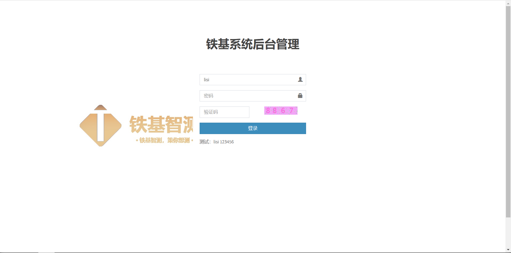

# EMeasure网页端开发日志
## 22.7.7
### 简单的登陆界面

登录页面

### 后台管理员的登录与退出
1. 在项目中添加中间件
    * 此中间件对后台网址访问做了是否登录的判断
    * 关于网站后台要求：只要访问的URL地址是以 "/myadmin" 开头的都会执行是否登录判断验证。

启动服务测试，网站后台无法直接获取，统一跳转登陆界面
    
## 22.7.8
### 后台管理员的登录与退出
2. 登录与退出
    * 配置路由
    * 编写视图文件，加入登录，登录验证，退出三个函数模块
    * 注意只有后台管理员才能登录，普通用户无法进入

    

        
    登录成功进入首页

    

        
    登录账号不存在提示

    
    

        
    密码错误提示

    

        
    非后台管理账号提示

    

        
    退出登录返回登录界面

## 22.7.9
### 后台管理员的登录与退出
3. 在后台登录处添加验证码

实现动态验证码验证

        
    提示验证码错误

## 22.7.10
### 服务器部署
1. 基于如下架构部署

    Python3.8 + ubuntu 20.04 + Nginx + uWSGI + Django3.2

    部署完成后，现可在[47.95.223.213](http://47.95.223.213/)访问，域名[emeasure.cn](emeasure.cn)仍在备案申请阶段
